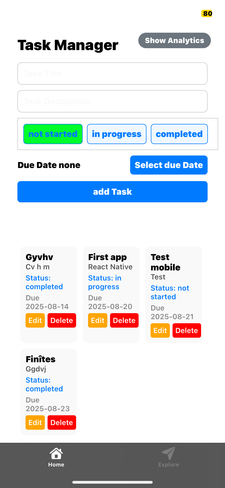
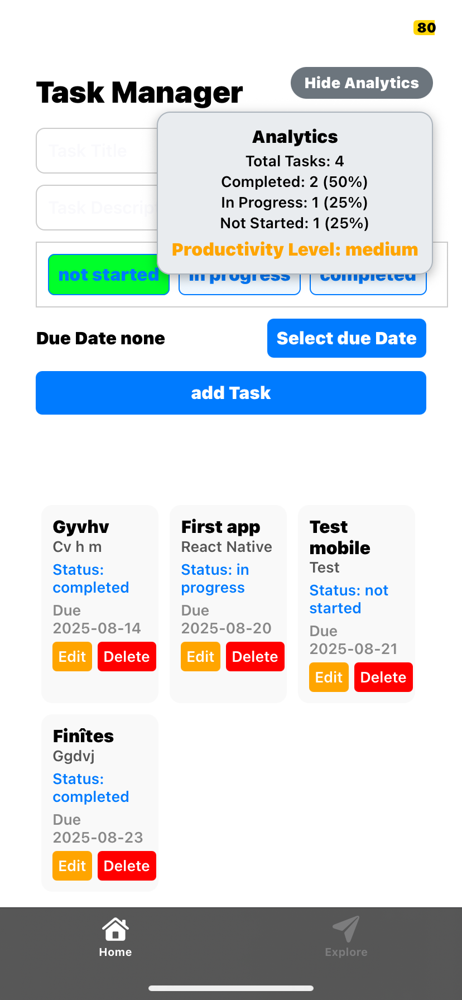
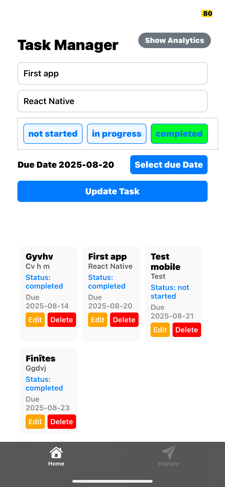

# Task Manager App

## Description

Bienvenue dans l'application Task Manager ! Cette application React Native vous permet de gérer vos tâches efficacement en suivant leur statut, leur date limite, et en visualisant des analyses de productivité.

---

## Fonctionnalités

- Ajouter, modifier et supprimer des tâches.
- Suivre le statut des tâches : **not started**, **in progress**, **completed**.
- Sélectionner une date limite pour chaque tâche.
- Afficher des analyses de productivité basées sur les tâches.
- Interface utilisateur intuitive et réactive.

---

## Captures d'Écran

### Vue Principale



### Vue avec Analyses



### edition d'une Tâche



---

## Installation

1. Clonez le dépôt :
   ```bash
   git clone https://github.com/BADZA99/ProductivityApp.git
   ```

2. Installez les dépendances :
   ```bash
   npm install
   ```

3. Lancez l'application :
   ```bash
   npx expo start
   ```

---

## Technologies Utilisées

- **React Native** : Framework pour le développement mobile.
- **Expo** : Plateforme pour simplifier le développement React Native.
- **React Navigation** : Gestion de la navigation.

---

## Auteur

Développé par **BADZA99**.


## Ressources

- [Documentation React Native](https://reactnative.dev/docs/getting-started)
- [Documentation Expo](https://docs.expo.dev/)
- [React Navigation](https://reactnavigation.org/)